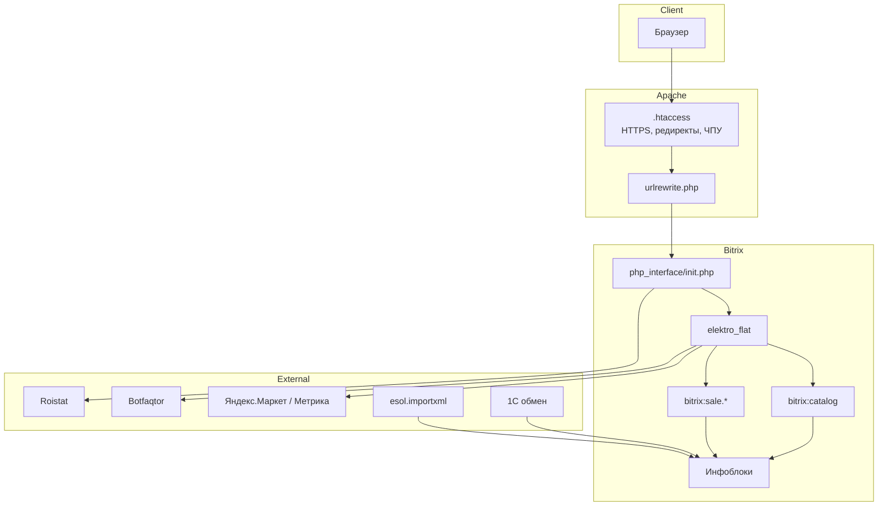
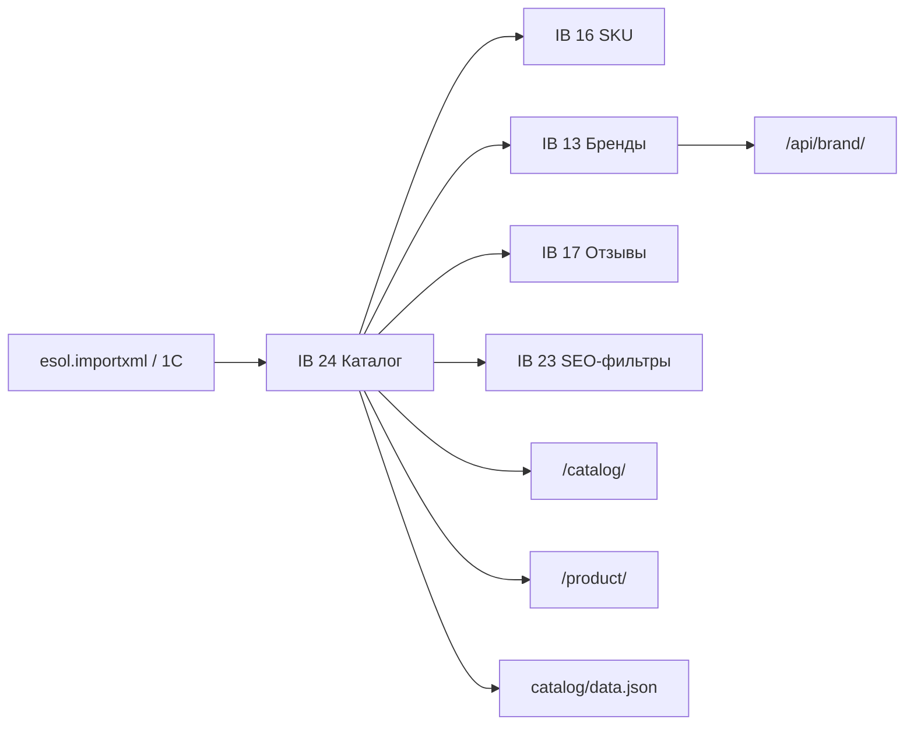

# Документация проекта VILMED

## Обзор

**VILMED** — интернет-магазин профессионального медицинского оборудования ([vilmed.ru](https://vilmed.ru)).

- Более 15 000 товаров
- Доставка по России
- Каталог по медицинским направлениям (ветеринария, ЛОР, офтальмология, хирургия, эндоскопия и др.)
- Контактный телефон на сайте: +7 (499) 113-02-79

Проект построен на **1C-Bitrix: Управление сайтом** с решением **ALTOP «Электроинструмент»** (шаблон `elektro_flat`).

---

## Технологический стек

| Компонент | Версия / описание |
|-----------|-------------------|
| CMS | 1C-Bitrix **22.0.400** (от 29.06.2022) |
| PHP | mod_php5 (по `.htaccess`) |
| БД | MySQL, кодировка `utf8` / `utf8_unicode_ci` |
| Веб-сервер | Apache (mod_rewrite, mod_php5) |
| Frontend | jQuery, Slick, Fancybox, Font Awesome, LESS |
| Решение | `altop.elektroinstrument` |
| Шаблон | `bitrix/templates/elektro_flat` («Flat шаблон») |
| Git remote | `git@github.com:bziksv/vilmed.git` |
| Боевой сервер | `217.28.220.186` (vilmed.ru) |

---

## Структура репозитория

```
vilmed/
├── vilmed.ru/              # Корень сайта (document root)
│   ├── bitrix/             # Ядро Bitrix, модули, шаблон, php_interface
│   ├── catalog/            # Каталог товаров (SEF: /catalog/)
│   ├── product/            # Карточки товаров (SEF: /product/)
│   ├── personal/           # Личный кабинет, корзина, заказы
│   ├── include/            # Подключаемые блоки главной и внутренних страниц
│   ├── ajax/               # AJAX-обработчики корзины и сравнения
│   ├── api/                # Служебные API-скрипты
│   ├── category-finder/    # Внутренний инструмент SEO/каталога
│   ├── generator-torgovych-predlozheniy/  # Генератор SKU
│   ├── about/, contacts/, delivery/, news/, vendors/ …  # Контентные разделы
│   └── urlrewrite.php      # ЧПУ-маршрутизация
├── vilmed.gz               # Архив бэкапа (~11 ГБ)
└── Логи сервера/           # Access/error-логи frontend и backend
```

> Кастомизация: `bitrix/php_interface/`, шаблон `elektro_flat`, компоненты `altop:*`, плюс `local/modules/` (например `prime.alerts`).

---

## Архитектура сайта



### Два URL-каталога

На сайте используются **два SEF-префикса** для одного инфоблока каталога (ID 24):

| URL | Назначение | SEF-шаблон элемента |
|-----|------------|---------------------|
| `/catalog/` | Основной каталог с разделами | `#SECTION_CODE#/#ELEMENT_CODE#/` |
| `/product/` | Короткие URL карточек товаров | `#ELEMENT_CODE#/` |

Массовые 301-редиректы в `.htaccess` переводят часть старых URL из `/catalog/` в `/product/`.

---

## Разделы сайта

| Путь | Компонент / назначение |
|------|------------------------|
| `/` | Главная страница |
| `/catalog/` | `bitrix:catalog` — основной каталог |
| `/product/` | `bitrix:catalog` — карточки товаров |
| `/personal/` | `bitrix:sale.personal.section` — ЛК, корзина, заказы |
| `/vendors/` | `bitrix:news` (шаблон `vendors`) — производители |
| `/news/` | Новости |
| `/promotions/` | Акции |
| `/reviews/` | Отзывы |
| `/about/`, `/contacts/`, `/delivery/`, `/payments/`, `/returns/`, `/warranty/`, `/faq/`, `/howtobuy/` | Информационные страницы |
| `/auth/` | Авторизация |
| `/map/` | Карта сайта |
| `/rest/` | Bitrix REST API |

Маршруты заданы в `vilmed.ru/urlrewrite.php`.

---

## Инфоблоки (основные ID)

ID инфоблоков зашиты в коде компонентов и include-файлах:

| ID | Назначение | Где используется |
|----|------------|------------------|
| **24** | Основной каталог товаров | `/catalog/`, `/product/`, include-блоки |
| **16** | Торговые предложения (SKU) | `generator-torgovych-predlozheniy` |
| **17** | Отзывы к товарам | параметр `IBLOCK_ID_REVIEWS` в каталоге |
| **13** | Производители / бренды | `/vendors/`, `/api/brand/` |
| **23** | SEO-фильтры | `USE_FILTER_SEO_IBLOCK` |
| **3** | Форма «Узнать цену» | `include/form_ask_price.php` |
| **25** | Форма «Подобрать аналог» | `include/form_ask_analog.php` |
| **7** | Геолокация / доставка | `include/geolocation.php` |
| **21** | Слайдер | `include/slider.php` |
| **19** | Новости | `include/news_*.php` |
| **18** | Акции | `include/promotions.php` |
| **20** | Отзывы (блок) | `include/reviews_*.php` |
| **22** | Контактная форма | `include/form_contact.php` |

Тип инфоблока каталога: `catalog`.

---

## Шаблон `elektro_flat`

Путь: `bitrix/templates/elektro_flat/`

### Ключевые файлы

- `header.php`, `footer.php` — каркас страницы, подключение CSS/JS, Open Graph
- `template_styles.css`, `colors.css` — стили
- `js/main.js`, `script.js` — клиентская логика
- `components/` — переопределения шаблонов компонентов Bitrix и ALTOP

### Кастомная шапка (`floating-header`)

Подключается в `header.php` (на всех хостах) двумя файлами:

- `css/floating-header.css`, `js/floating-header.js`

Что делает (JS работает поверх существующего DOM, без правок разметки шаблона):

- **Плавающая (sticky) шапка** при скролле: логотип, кнопка «Каталог» (выезжающее off-canvas меню разделов), быстрый поиск, город, телефон, иконки кабинета/сравнения/избранного/корзины.
- **Быстрый поиск** (в плавающей и статичной шапке) поверх `altop:search.title`: исправление раскладки (ЙЦУКЕН⇄QWERTY), опечаток (Левенштейн по словарю категорий), транслитерация брендов. Нативный дропдаун `.title-search-result` скрыт.
- **Перекомпоновка статичной шапки:** строка поиска укорочена (`#altop_search` = `calc(100% - 170px)`), блок «Время работы» (`.vilmed-hdr-sched-moved`, `position:absolute; right:14px`) перенесён правее, иконки кабинета (сетка 2×2) — рядом, город/телефон прижаты вправо; кнопка «Заказать звонок» и левый рейл `.foot_panel_all` скрыты (CSS). Зарезервированная ширина (170px) и `right:14px` подобраны так, чтобы расписание не наезжало ни на поиск, ни на иконки.
- **Время работы** генерируется автоматически по дню/времени (ПН–ПТ 09:00–19:00): «Сегодня до 19:00» / «Сегодня выходной — В ПН с 09:00 до 19:00» и т.п. Время берётся из браузера пользователя.
- Счётчики корзины/сравнения/избранного зеркалятся в иконки через `MutationObserver`.
- **Мобильная шапка** (≤787px): статичная шапка скрыта, плавающая всегда видна; кнопка «Каталог» = бургер (открывает off-canvas меню); поиск — иконка-лупа, по клику открывается полоса на всю ширину.

> **Адаптивные брейкпоинты проекта** (используются в `floating-header.css`): `≤600px` — узкий телефон, `≤787px` — мобайл/планшет (главный мобильный порог), `≥992px` — десктоп (раскладка галереи карточки). Десктоп-правки шапки проверять и на 1024px, и на 1280px.

> **Эмуляция в браузер-MCP** на этом проекте часто игнорирует `Emulation.setDeviceMetricsOverride` (рендер идёт в реальной ширине окна, `innerWidth` ≠ заданной). Надёжнее проверять геометрию замером `getBoundingClientRect()` и сверять с реальной `clientWidth`, а не доверять заданной ширине эмуляции.

> Деплой правок шапки: правка глобальная (в `<head>` всех страниц) — после `git push` на сервере `INVALIDATE_HOME=1 bash tools/perf/prod-deploy.sh` (FLUSHDB сбрасывает managed-кеш, композит перегенерируется на следующем визите).

### Страница раздела каталога — список подкатегорий

- Блок `bitrix:catalog.section.list` (карточки подкатегорий, `#catalog-section-list`) остаётся в штатном месте в `components/bitrix/catalog/.default/section.php` — **над списком товаров** (PHP-шаблон не перемещали).
- JS (`floating-header.js`, отдельный IIFE в конце файла) + CSS (`floating-header.css`) добавляют поверх блока, **не трогая разметку**:
  - **«первые 12 + Показать ещё»**: каждый список `.catalog-section-childs` сворачивается до 12 карточек (класс `.vilmed-cats-collapsed`, CSS-правило `.catalog-section-childs.vilmed-cats-collapsed > .catalog-section-child:nth-child(n+13)`), кнопка `.vilmed-cats-more` разворачивает полностью. Лимит задан константой `LIMIT` в IIFE — **менять и в JS (`LIMIT`), и в CSS (`nth-child`) синхронно.**
  - **Фильтр по категориям** `.vilmed-cats-filter` — поле поиска над списком, **видно только на мобиле** (≤787px); фильтрует карточки и группы по названию (ё-нечувствительно), на время фильтра лимит снимается. Состояние «развёрнуто» запоминается (`expanded`), кнопка `.vilmed-cats-more` прячется, а не удаляется, — чтобы вернуться после сброса фильтра.
- Блок `.tag_menu` («Популярные категории» из левого сайдбара) **скрыт на мобиле** (`@media (max-width: 787px)`) — на узких экранах сайдбар сваливался наверх и давал пустоту.

### Карточка товара (`bitrix:catalog.element`, шаблон `.default`)

Доработки карточки. Часть — правки PHP-шаблонов, часть — наложение через `floating-header.js`/`.css` поверх готового DOM.

**Файлы:**

| Файл | Что изменено |
|------|--------------|
| `components/.../catalog.element/.default/template.php` | способы оплаты (SVG-иконки вместо VISA/MasterCard), уведомление в табе «Характеристики» (`.vilmed-spec__alert`), форматирование «Комплектации»; **удалены** вкладка «Отзывы и вопросы» и форма отзыва |
| `components/.../catalog.element/.default/component_epilog.php` | **удалён** блок `#catalog-reviews-from` (компонент `altop:catalog.reviews.list`) |
| `components/bitrix/catalog/.default/element.php` | блок **«С этим товаром покупают»** (`//ALSO_BUY//`) перед «Похожими» |
| `product/index.php` | `USE_COMPARE` = `Y` (вернули кнопку «Сравнить» на карточке) |
| `header.php` | лайтбокс `product-lightbox.css/js` подключается **только на карточке** (`isProductDetail()`); на карточке к `.page-wrapper` добавляется класс `.vilmed-product` |
| `css/floating-header.css` | стили: артикул в блоке цены, скрытие звёзд рейтинга, кнопки «Сравнить/Отложить», способы оплаты, вертикальная лента миниатюр (десктоп) |
| `js/floating-header.js` | `placeArticleInPrice()` переносит `.catalog-detail-article` в блок цены и прячет `.article_rating` |

**Ключевые детали:**

- **«С этим товаром покупают»** — встроенная аналитика заказов Bitrix: `\Bitrix\Sale\Internals\Product2ProductTable` (таблица `b_sale_product2product`), фильтр по `PARENT_PRODUCT_ID`. Блок **рендерится только если есть данные о совместных покупках** — на товарах без статистики его не будет (это не баг).
- **Лайтбокс галереи** (`js/product-lightbox.js` + `css/product-lightbox.css`) — собственный, заменяет fancybox 1.3.1. Перехват клика по `.catalog-detail-images` в фазе capture, свайп пальцем (`touchmove` non-passive + `preventDefault`), превью снизу, закрытие по фону/Esc. Класс блокировки скролла — `html.vlb-lock`.
- **Миниатюры галереи** на десктопе (`@media min-width: 992px`): `.catalog-detail-pictures` → flex-row, главное фото слева, `.more_photo` — вертикальная лента справа (96px). Колонка `.column.first` расширена до 500px, чтобы заполнить пустоту рядом с блоком покупки. На планшете/мобиле миниатюры остаются под фото.
- **Кнопки «Купить/Купить в 1 клик/Сравнить/Отложить»** выровнены по ширине: базовые стили `.compare_delay` дают ряд 50/50 (`flex: 1 1 0`, `flex-wrap: nowrap`); на мобиле (≤787px) «Купить» растянут на всю ширину (override `display:table` темы), ≤600px — «Сравнить/Отложить» друг под другом.
- **Цена + количество в один ряд** (`js/floating-header.js`): `.qnt_cont` переносится из `.catalog-detail-buy` в `.vmd-price-row` рядом с ценой, артикул — строкой под ценой (`.vmd-article-below`). Вид степпера (−/+ + инпут) воссоздан в `css/floating-header.css` для `.vmd-price-row .qnt_cont`, т.к. родные стили темы привязаны к `.buy_more_detail`. Товары с торговыми предложениями (SKU) пропускаются.

### Оформление описания товара (`.vmd-desc`)

Дизайн-система для детального описания: заголовки, карточки преимуществ, таблица ТТХ (zebra), callout-примечания (info/warn/accent), FAQ на `<details>`, CTA-форма «цена по запросу». Всё изолировано под `.vmd-desc`.

| Файл | Назначение |
|------|------------|
| `css/vmd-description.css` | Переносимый scoped-CSS. Подключается в `header.php` внутри `isProductDetail()`. |
| `css/VMD-DESCRIPTION.md` | **Полная документация**: справочник всех классов, иконки (line-SVG в стиле Lucide), готовый скелет и **промт для генерации описаний**. |

- Контент кладётся в **детальный текст товара** (HTML-исходник), обёрнутый в `<article class="vmd-desc">…</article>`.
- Иконки — инлайновый `<svg>` в line-стиле (Lucide, MIT): `viewBox="0 0 24 24" fill="none" stroke="currentColor"`; цвет наследуется от блока (красный в карточках, синий/жёлтый в callout).
- JS не нужен (FAQ — нативный `<details>`).
- Превью полного вида (на dev): `_vmd-preview.html` в корне — статичный снимок страницы товара с вставленным оформленным описанием (генерируется `.local/content-mockups/build_fullpage.py`).

### Настройки решения

В `header.php` подключается компонент `altop:settings`, который загружает глобальный массив `$arSetting` (оформление, хлебные крошки, расположение корзины и т.д.).

Модуль `altop.elektroinstrument` отвечает за:
- фон сайта (`CElektroinstrument::getBackground`)
- canonical URL (`CElektroinstrument::SetCannonicalURL`)
- параметры решения в админке

---

## Компоненты ALTOP

Кастомные компоненты в `bitrix/components/altop/`:

| Компонент | Назначение |
|-----------|------------|
| `altop:settings` | Настройки темы/решения |
| `altop:search.title` | Живой поиск в шапке |
| `altop:geolocation` / `geolocation.delivery` | Определение города и условий доставки |
| `altop:buy.one.click` | Покупка в один клик |
| `altop:catalog.reviews` / `catalog.reviews.list` | Отзывы к товарам |
| `altop:forms` | Формы обратной связи |
| `altop:user` | Блок пользователя |

---

## Установленные модули

### Решение и тема
- `altop.elektroinstrument` — базовое решение интернет-магазина

### Каталог и обмен
- `esol.importxml` — импорт каталога из XML (cron)
- `askaron.pro1c` — интеграция с 1С
- `yandex.market` — Яндекс.Маркет

### SEO и производительность
- `arturgolubev.cssinliner` — инлайн CSS
- `arturgolubev.htmlcompressor` — сжатие HTML
- `delight.webpconverter` — конвертация в WebP
- `dev2fun.imagecompress` — сжатие изображений
- `prime.smartbanners` — smart-баннеры

### Прочее
- `asd.iblock` — расширения инфоблоков
- `askaron.agents` — агенты
- `niges.cookiesaccept` — cookie-баннер
- `prime.alerts` (1.2.2) — политика e-mail (запрет иностранных доменов на регистрации/заказе), `local/modules/prime.alerts/`. Frontend (`OnEndBufferContent`) инжектит CSS/JS **только** в HTML с `</body>` / не в AJAX — иначе ломает JSON («Купить в 1 клик», выбор города на оформлении).
- `arturgolubev.chatgpt` (6.2.0) — генерация контента (ChatGPT / DeepSeek / GigaChat), админка `/bitrix/admin/arturgolubev_chatgpt_*.php`, таблицы `ag_chatgpt_*`. Устанавливался на prod вне git → в репозитории с 2026-08.
- `sng.secure` — безопасность
- `abtest` — A/B тестирование

---

## Кастомный PHP-код

### `bitrix/php_interface/init.php`

Точка входа для глобальной логики:

1. **301-редирект на lowercase URL** — все URL (кроме `/bitrix/`) приводятся к нижнему регистру
2. **Roistat** — при создании заказа в письмо добавляется cookie `roistat_visit`
3. Подключение `catalog_section_list_json.php` и `functions.php`

> В git отслеживается только `init.php`; остальные файлы `php_interface/` в `.gitignore`.

### `bitrix/php_interface/include/functions.php`

| Функция | Описание |
|---------|----------|
| `getSubSecions($IBLOCK_ID, $CODE)` | Получение дочерних разделов каталога |
| `isProductDetail()` | Проверка, что текущая страница — `/product/...` |
| `isCatalogDir()` | Проверка, что текущая страница — `/catalog/...` |

### `bitrix/php_interface/include/catalog_section_list_json.php`

Генерирует JSON-файл `catalog/data.json`: соответствие артикула (`CML2_ARTICLE`) и названий разделов каталога. Используется для внешних интеграций или внутренних скриптов.

### `bitrix/php_interface/after_connect_d7.php`

Настройки MySQL-сессии:
- `SET NAMES utf8`
- `collation_connection = utf8_unicode_ci`
- `sql_mode=''`
- `innodb_strict_mode=0`

---

## AJAX-обработчики

Папка `ajax/`:

| Файл | Назначение |
|------|------------|
| `add2basket.php` | Добавление товара в корзину |
| `add2delay.php` | Отложенные товары |
| `basket_line.php` | Мини-корзина в шапке |
| `delay_line.php` | Строка отложенных |
| `compare_line.php` | Блок сравнения |
| `popup.php` | Всплывающие окна |

---

## Служебные инструменты

### `/api/brand/index.php`

Скрипт синхронизации свойства «Производитель» (`MANUFACTURER`) в каталоге (IB 24) с инфоблоком брендов (IB 13). Берёт значение «Бренд» из `CML2_ATTRIBUTES` и привязывает элемент бренда.

> Запускается вручную, без авторизации. Рекомендуется ограничить доступ на уровне веб-сервера.

### `/generator-torgovych-predlozheniy/`

Генератор торговых предложений (SKU) для товаров без offers. Создаёт SKU в IB 16 на основе множественных свойств `ARTICLS` и `PRICES` родительского товара.

> Служебный скрипт для миграции/обслуживания каталога. Не предназначен для публичного доступа.

### `/category-finder/`

Внутренний инструмент (требует авторизации `NEED_AUTH`). Порт функционала **categoryfinder** из almamed (Shop-Script → Bitrix):

| Файл | Назначение |
|------|------------|
| `index.php` | UI: фильтры, таблица, экспорт |
| `scripts/CategoryFinderService.php` | Логика поиска, дубликатов, витрины |
| `scripts/server.php` | JSON API для DataTables |
| `scripts/update.php` | Сохранение `UF_WITHOUT_PROD` |
| `css/admin.css`, `js/admin.js` | Стили и фронт |

**Фильтры:** инфоблок, уровень, «свои» товары, «на витрине», название, активность, без редиректа (`CODE` не `-r`), `UF_WITHOUT_PROD`, **дубликаты** (по названию / CODE / совместный + порог схожести URL).

**Колонки:** уровень, ID, свои/подкат./в поддер./на витрине, название, CODE, ссылка, дубликаты (с подсветкой групп), чекбокс «Без товаров».

**Экспорт:** Excel через DataTables Buttons.

**Вёрстка:** для раздела задано `HIDE_LEFT_COLUMN=Y` в `.section.php` — левая колонка каталога скрыта, контент на полную ширину (`workarea-order`).

---

## Include-блоки (`include/`)

Переиспользуемые фрагменты, подключаемые на главной и внутренних страницах:

- `slider.php`, `banners_main.php` — слайдеры и баннеры
- `newproduct.php`, `saleleader.php`, `discount.php` — витрины товаров
- `recommend.php`, `linked.php`, `viewed_products.php` — рекомендации

> **Случайные товары без `ORDER BY RAND()` (с 2026-06-29).** Блоки `newproduct/saleleader/discount`
> (шаблон `filtered`) и `recommend` (шаблон `bigdata`) больше не используют `ELEMENT_SORT_FIELD=RAND`
> (он обнулял кеш). Теперь: кешируемая сортировка `ID DESC`, пул `PAGE_ELEMENT_COUNT=24` и кастомные
> параметры `VMD_RANDOM=Y` / `VMD_RANDOM_COUNT=4`. В `result_modifier.php` обоих шаблонов пул
> перемешивается в PHP и берутся первые N. `linked.php` использует тот же `filtered`, но без
> `VMD_RANDOM` → не затронут. Подробности: `.local/performance/SLOW-QUERY-ANALYSIS.md`.
- `sections.php`, `vendors_bottom.php` — каталог и бренды
- `form_*.php` — формы (обратный звонок, дешевле, под заказ и др.)
- `geolocation.php` — блок геолокации
- `header_search.php` — поиск в шапке

---

## SEO и URL

### `.htaccess`

- Принудительный **HTTPS** (исключения: `/bitrix/admin/1c_exchange.php`, `/hand1CtoSite.php`)
- Редирект `www` → без `www`
- Добавление trailing slash
- Удаление `index.php` из URL
- Блокировка ряда IP-подсетей
- Сотни **301-редиректов** для SEO (миграция `/catalog/` → `/product/`, переименование разделов)
- Поддержка кириллических URL через `virtual_file_system.php`

### Canonical и Open Graph

В `header.php` настроены meta-теги Open Graph; canonical URL выставляется через `CElektroinstrument::SetCannonicalURL`.

### Внешняя аналитика

- **Roistat** — передача visit ID в письма о заказах
- **Botfaqtor** — `_ab_id_=163177`, скрипт `cdn.botfaqtor.ru/one.js`
- **Яндекс.Маркет** — модуль `yandex.market`, экспорт `/bitrix/services/ymarket/`

---

## Интеграции

| Система | Механизм |
|---------|----------|
| **1С** | Стандартный обмен Bitrix (`/bitrix/admin/1c_exchange.php`), модуль `askaron.pro1c` |
| **Импорт XML** | `esol.importxml`, cron: `bitrix/php_interface/include/esol.importxml/cron_events.php` |
| **Яндекс.Маркет** | Модуль `yandex.market`, YML-экспорт в `bitrix/catalog_export/` |
| **Roistat** | Cookie → поле `ROI_VISIT` в письме заказа |
| **Яндекс.Метрика** | Через модуль yandex.market |

---

## Личный кабинет и заказы

- Корзина: `/personal/cart/`
- Оформление: `/personal/order/make/`
- Оплата: `/personal/order/payment/`
- Компонент: `bitrix:sale.personal.section`
- Тип цены: `BASE`
- Склады: ID 1, 2

---

## Git

- Remote: `origin` → [github.com/bziksv/vilmed](https://github.com/bziksv/vilmed)
- Git-репозиторий находится в `vilmed.ru/.git` (не в корне `vilmed/`)
- Ветка: `main`
- Старый remote прошлого разработчика: `https://github.com/neeil1990/vilmed.git` — **не использовать**

### Первичная настройка (один раз)

```bash
cd ~/Documents/projects/vilmed/vilmed.ru
git remote set-url origin git@github.com:bziksv/vilmed.git
git branch -M main
git push -u origin main
```

### Ежедневный workflow (как в almamed)

```bash
cd ~/Documents/projects/vilmed/vilmed.ru
git add -A
git status --short | wc -l
git commit -m "updated"
git push origin main
```

> `git status --short | wc -l` — быстрая проверка, сколько файлов попало в коммит.

### Локальная копия — что не хранить

На диске **не держим** (тянем с боевого `217.28.220.186` при необходимости):

| Папка | Назначение |
|-------|------------|
| `upload/` | Медиа, картинки товаров (~10 ГБ) |
| `bitrix/html_pages/` | Композитный кеш страниц |
| `bitrix/cache/`, `managed_cache/`, `stack_cache/` | Runtime-кеш |
| `bitrix/backup/`, `bitrix/catalog_export/` | Бэкапы и выгрузки |
| `Логи сервера/` | Логи nginx/apache (вне git) |

Подтянуть медиа с прода:

```bash
rsync -avz user@217.28.220.186:/var/www/.../upload/ ~/Documents/projects/vilmed/vilmed.ru/upload/
```

Дамп БД для local: `vilmed_ru.sql` в корне `vilmed/` → `./.local/setup-local-db.sh` + импорт.

> Путь document root на сервере уточнить у хостинга.

**В git остаётся только код:** шаблон, altop-компоненты, `init.php`, кастомные модули, страницы сайта.

### `.gitignore`

Исключены из версионирования:
- `upload/*`
- `bitrix/cache/*`, `bitrix/managed_cache/*`, `bitrix/html_pages/*`
- `bitrix/backup/*`, `bitrix/catalog_export/*`
- `bitrix/.settings.php`, `bitrix/php_interface/*` (кроме `init.php`)
- `.htaccess`, `sitemap*.xml`
- логи, архивы (`*.tar`, `*.tar.gz`)

### Последние коммиты (на момент анализа)

- `#163556` — рекомендуемые товары
- `#154419` — element groups, recommended
- `#153401` — popup, сортировка
- `#152943` — flying cart

---

## Развёртывание

### Требования

- PHP 7.x+ (на проде указан mod_php5)
- MySQL / MariaDB
- Apache с mod_rewrite
- Расширения PHP: стандартный набор Bitrix

### Локальный MySQL

| | |
|---|---|
| Порт | **3307** (3306 занят almamed) |
| Host в `.settings.php` | `127.0.0.1:3307` |
| User / pass | `vilmed` / `localdev` |
| Database | `vilmed_ru` |
| Datadir | `/opt/homebrew/var/mysql` (MySQL 9.7) |
| Конфиг | `.local/mysql/dev.cnf` |

```bash
./.local/mysql/start.sh     # поднять mysqld на :3307
./.local/use-db-local.sh    # переключить сайт на local :3307
./.local/use-db-remote.sh   # обратно на prod DB
./.local/mysql/stop.sh      # остановить только vilmed-инстанс
```

Не мешает almamed (`:3306`, datadir `mysql@8.0`).

### Локальный dev-сервер

```bash
./start-dev.sh   # nginx + php-fpm 7.4, порт 8082
./stop-dev.sh
```

- URL: **http://localhost:8082/**
- php-fpm: `127.0.0.1:9082`
- БД по умолчанию для dev: **local** `127.0.0.1:3307` / `vilmed` / `localdev` / `vilmed_ru`
- `/upload/` — proxy на `vilmed.ru`, если файла нет локально

### Реестр картинок сайта

| | |
|---|---|
| URL | http://localhost:8082/tools/site-images.php |
| Prod | https://vilmed.ru/tools/site-images.php |
| Файл | `tools/site-images.php` |

Собирает изображения из `b_file` / `upload/`. В таблице:

- где используется (элемент инфоблока, свойство, UF)
- прямая ссылка на файл (всегда `https://vilmed.ru/...`)
- кнопка «Скачать»
- даты создания/изменения (файл + БД)
- экспорт в Excel (`?export=excel`)
- умный поиск по названию товара, артикулу, ID

Доступ: localhost или админ Bitrix.

**Скорость:** remote DB (`217.28.220.186`) → **~30–40 с/страница**. Local DB → **1–3 с**.

```bash
./.local/sync-db-from-prod.sh   # один раз: дамп prod → local (~1 GB, 10–20 мин)
./.local/use-db-local.sh        # быстро (local MySQL)
./.local/use-db-remote.sh       # медленно, но актуальные данные с prod
```

### Боевой сервер

| Параметр | Значение |
|----------|----------|
| IP | `217.28.220.186` |
| Домен | vilmed.ru |
| Document root | `/var/www/vilmed_ru_usr/data/www/vilmed.ru/` |
| Владелец файлов | `vilmed_ru_usr:vilmed_ru_usr` |
| RAM | 11 GiB, **swap 6 GiB** (`/swapfile`, в `/etc/fstab`, с 2026-08-05) |
| MySQL buffer pool | **4G** (было 9G → OOM). Правки в **обоих** файлах: `/etc/mysql/conf.d/mysql.cnf` и `/etc/mysql/my.cnf.fastpanel/99-fastpanel.cnf` (FastPanel подключается последним через `!include`) |
| `innodb_log_buffer_size` | **64M** (было 1024M) |

> OOM: MySQL убивался ядром (dmesg), т.к. `innodb_buffer_pool_size=9G` + Redis 2G на 11G RAM. Swap — подушка; buffer pool снижен 2026-08-05. Бэкапы конфигов: `*.bak.YYYYMMDDHHMMSS` рядом с файлами.

### Деплой на prod

**Полный деплой** (рекомендуется — учитывает dirty prod, бэкап `.settings.php`):

```bash
cd /var/www/vilmed_ru_usr/data/www/vilmed.ru
bash /path/to/repo/.local/security-audit/prod-deploy.sh
```

Или вручную:

```bash
cd /var/www/vilmed_ru_usr/data/www/vilmed.ru

cp -a bitrix/.settings.php /root/.settings.php.bak
git fetch origin main && git reset --hard origin/main
cp -a /root/.settings.php.bak bitrix/.settings.php

# Кеш Bitrix (НЕ контент сайта, НЕ upload/)
find bitrix/cache bitrix/managed_cache bitrix/stack_cache bitrix/html_pages \
  -mindepth 1 -delete 2>/dev/null

chown -R vilmed_ru_usr:vilmed_ru_usr .
rm -rf assets
```

| Каталог | Что это | Можно чистить? |
|---------|---------|----------------|
| `bitrix/cache/` | Кеш Bitrix | ✅ да |
| `bitrix/managed_cache/` | Управляемый кеш | ✅ да |
| `bitrix/stack_cache/` | Stack cache | ✅ да |
| `bitrix/html_pages/` | **Композитный HTML-кеш** (страницы пересобираются) | ✅ да |
| `upload/` | Медиа, фото товаров | ❌ **никогда** |
| `assets/` | Был заражён, не Bitrix | ✅ удалить (`rm -rf`) |

Сообщение админки «Идёт удаление файлов кеша… `html_pages/.../product/...`» — **нормально**: это кеш композита, не исходники страниц в git.

> ⚠️ **ВАЖНО: кеш Bitrix хранится в Redis, а не в файлах.**
> `bitrix/.settings.php` → `cache.type = redis` (sid `vilmed_ru`, `127.0.0.1:6379`).
> Поэтому `find bitrix/cache -delete` / очистка `managed_cache`, `stack_cache`, `html_pages`
> **НЕ сбрасывают** managed/component/**composite**-кеш — он весь в Redis.
> Если правки шаблонов/компонентов «не подхватываются» на prod — кеш в Redis не сброшен.
>
> **Сериализатор Redis:** на prod PHP `redis.so` **без** `Redis::SERIALIZER_IGBINARY`.
> В `bitrix/modules/main/lib/data/cacheengineredis.php` должен быть `\Redis::SERIALIZER_PHP`
> (дефолт и ветка `serializer == 2`). Версия с `SERIALIZER_IGBINARY` роняет весь сайт.
> Бэкап на сервере: `cacheengineredis.php.bak.vilmed`.
>
> **Сброс кеша (единственный рабочий способ):**
> ```bash
> redis-cli FLUSHDB    # сессии на файлах (session.save_handler=files) — безопасно
> systemctl reload apache2
> ```
> `tools/perf/prod-deploy.sh` делает это автоматически (`FLUSH_REDIS=1` по умолчанию).
> Composite отдаётся **реальным браузерам** (быстрый TTFB); боты/`curl` получают полную
> регенерацию (TTFB ~2–4 с) — это не показатель скорости для пользователей.
> Проверка применения правок на чистом URL: composite кешируется по URL+query,
> поэтому `?nocache=<ts>` форсирует свежую генерацию в обход composite.

### Канонический деплой (актуально)

Рабочий скрипт — **`tools/perf/prod-deploy.sh`** (в репозитории, на проде по тому же пути). Делает: бэкап `.settings.php` → `git pull origin main` → восстановление `.settings.php` → `redis-cli FLUSHDB` (кеш Bitrix в Redis) → чистка `bitrix/cache|managed_cache|stack_cache` → `apache2ctl configtest && reload` → `chown`.

```bash
ssh vilmed 'cd /var/www/vilmed_ru_usr/data/www/vilmed.ru && bash tools/perf/prod-deploy.sh'
```

**Флаги** (env-переменные перед командой):

| Флаг | Действие |
|------|----------|
| `INVALIDATE_HOME=1` | сбросить композит только главной (после правок footer/header/главной) |
| `RUN_WARMUP=1` | полный прогрев композита + sitemap + webp (долго, **не для каждой правки**) |
| `CLEAR_HTML_PAGES=1` | полная очистка `bitrix/html_pages` — ⚠️ **сносит и `.config.php`** (восстановить: см. ниже `composite-restore-config.php`, либо `/bitrix/admin/composite.php` → Сохранить). По умолчанию не использовать. |
| `FLUSH_REDIS=1` | сброс Bitrix-кеша в Redis (**ВКЛ по умолчанию**) |

### SSH

- **Подключаться через alias `ssh vilmed`** (в `~/.ssh/config`). Подключение по IP `root@217.28.220.186` сервер часто рвёт (`Connection closed by … port 22`); частые повторные коннекты тоже троттлятся — между попытками делать паузу 10–20 с.

### nginx и сжатие (gzip + brotli)

На сервере **два** nginx (важно не путать):

| Процесс | Бинарник | Конфиг | Роль |
|---------|----------|--------|------|
| Сайты (80/443) | `/usr/sbin/nginx` | `/etc/nginx/nginx.conf` | **отдаёт vilmed.ru** |
| Панель | `/usr/local/sbin/fastpanel2-nginx` | `/usr/local/fastpanel2-nginx/nginx.conf` | UI FastPanel |

`nginx` в `PATH` и `systemctl reload nginx` — это **сайтовый** `/usr/sbin/nginx`. `nginx.conf` и
`fastpanel2-sites/*/*.conf` **автогенерируются FastPanel** (не править!); кастомные директивы —
в `fastpanel2-sites/<user>/<domain>.includes` (server-контекст, переживает регенерацию).

**Сжатие:** gzip (comp_level 5) + **Brotli** (динамич. модуль, с 2026-06-29). Браузер с
`Accept-Encoding: br` получает brotli (−~11% поверх gzip), остальные — gzip.

- модули: `/usr/lib/nginx/modules/ngx_http_brotli_*.so`
- `load_module`: `/etc/nginx/modules-enabled/50-brotli.conf`
- директивы: в `vilmed.ru.includes` (блок `# >>> VILMED brotli`)
- ⚠️ **при апгрейде пакета nginx модуль надо пересобрать** (`not binary compatible`) —
  скрипты и инструкция: `.local/performance/BROTLI.md`, `build-brotli.sh`, `install-brotli.sh`.

**MySQL slow query log** уже включён (`/var/log/mysql/slow.log`, logrotate 7д). Анализ и находки
(`ORDER BY RAND()` на vilmed) — `.local/performance/SLOW-QUERY-ANALYSIS.md`. `ORDER BY RAND()`
устранён 2026-06-29 (см. «Include-блоки» выше — вариант 1: кешируемый пул + перемешивание в PHP).

### Композит при правках шаблонов карточки/каталога

`FLUSHDB` сбрасывает managed/component-кеш в Redis, но **полностраничный композит** (`bitrix/html_pages/*.html`) — это статические файлы, которые правками **шаблонов** (PHP/CSS/JS) сами не инвалидируются. Чтобы изменения карточки/каталога/шапки гарантированно отобразились, очистить композит, **сохранив** `.config.php` и `.enabled` (правило: их не удалять):

```bash
ssh vilmed 'cd /var/www/vilmed_ru_usr/data/www/vilmed.ru && \
  find bitrix/html_pages -mindepth 1 ! -name ".config.php" ! -name ".enabled" -delete 2>/dev/null; \
  chown -R vilmed_ru_usr:vilmed_ru_usr bitrix/html_pages'
```

> CSS/JS-правки (floating-header, product-lightbox) грузятся как отдельные ассеты и видны сразу; PHP-правки шаблонов попадают в композит — для них и нужна очистка выше.

**Восстановление `.config.php` после `CLEAR_HTML_PAGES`** (правило: файл удалять нельзя). На сервере **CLI `php` = 8.1 и роняет ядро Bitrix** (`$GLOBALS … syntax`), поэтому запускать через PHP версии сайта — `/opt/php74` — с коротким тегом:

```bash
ssh vilmed 'cd /var/www/vilmed_ru_usr/data/www/vilmed.ru && \
  /opt/php74/bin/php -d short_open_tag=On tools/perf/composite-restore-config.php && \
  chown vilmed_ru_usr:vilmed_ru_usr bitrix/html_pages/.config.php'
```

Скрипт делает то же, что админка `composite.php` → «Сохранить» (`Composite\Helper::setOptions()`).

### Дедупликация фото в галерее карточки

Главное фото товара часто **повторно загружено** как первое «доп. фото»: это **разные файлы** (разные `iblock`-пути) с одинаковым содержимым — по URL не отличить, в галерее/лайтбоксе шёл дубль. Отсев в `…/catalog.element/.default/result_modifier.php` (блок `VILMED_MORE_PHOTO_DEDUP`): из `MORE_PHOTO` убираются записи, совпадающие с `DETAIL_PICTURE` и между собой по **md5** и **dHash** (пересжатый JPEG с другим хешем). Хелперы — `vilmedImagePerceptualHash()` / `vilmedImageHashesSimilar()` в `bitrix/php_interface/include/functions.php`. JS-лайтбокс (`product-lightbox.js`) дополнительно схлопывает `resize_cache`-варианты одного файла.

**Проверка прода без правок кода:** `?nocache=<ts>` форсирует свежую генерацию в обход композита; `curl` всегда получает полную регенерацию (TTFB ~2–4 с — это не скорость для реальных браузеров).

**Не используйте `git pull` на prod с локальными правками** — упадёт с merge error. Только `fetch` + `reset --hard origin/main` (или скрипт деплоя, который делает pull в чистом дереве).

**Не используйте `git clean -fd` без бэкапа** — снесёт untracked файлы модулей.

**Не трогается git'ом** (`.gitignore`): `upload/`, `.htaccess`, `bitrix/.settings.php`.

Первый раз на сервере — настроить git remote `git@github.com:bziksv/vilmed.git`, ветка `main`.

### Document root

Корень веб-сервера: `vilmed.ru/`

### Конфигурация (не в git)

| Файл | Назначение |
|------|------------|
| `bitrix/.settings.php` | Параметры подключения к БД, кеш |
| `bitrix/php_interface/dbconn.php` | Legacy-подключение к БД |
| `.htaccess` | Правила Apache (не в git) |

### Cron-задачи

Рекомендуемые агенты Bitrix + импорт:

```bash
# Агенты Bitrix (каждую минуту)
*/1 * * * * php /path/to/vilmed.ru/bitrix/modules/main/tools/cron_events.php

# Импорт XML (если используется очередь esol.importxml)
*/5 * * * * php /path/to/vilmed.ru/bitrix/php_interface/include/esol.importxml/cron_events.php
```

### Бэкап

В корне репозитория есть архив `vilmed.gz` (~11 ГБ) — полный дамп/бэкап сайта.

---

## Логи сервера

Папка `Логи сервера/` (~402 МБ) — **не удалять**, не в git.

Анализ: `.local/logs-analysis/SECURITY-REPORT.md`, база `.local/logs-analysis/vilmed_logs.db`

```bash
python3 .local/logs-analysis/import-logs.py   # переимпорт после новых логов
```

- `vilmed.ru-frontend.access.log*`
- `vilmed.ru-frontend.error.log*`
- `vilmed.ru-backend.access.log*`
- `vilmed.ru-backend.error.log*`

Frontend/backend разделены — вероятно, используется reverse proxy или балансировщик перед Apache/PHP.

---

## Безопасность

**Чеклист и отчёты (актуально):**
- `.local/security-audit/SECURITY-CHECKLIST.md` — общий чеклист (обновляется)
- `.local/security-audit/FILE-AUDIT-REPORT.md` — файловый аудит шеллов
- `.local/logs-analysis/SECURITY-REPORT.md` — анализ access-логов

```bash
python3 .local/security-audit/scan-webroot.py   # пересканировать PHP
```

### Git pull и шеллы на prod

- Файл **был в git** и удалён в коммите → `git pull` **удалит** его на сервере.
- Файл **только на prod** (например `fafd0bfa5cc0.php`) → pull **не тронет** — удалить вручную + `find`.

### Сделано локально (2026-06-22)

- Удалены **83 шелла** `assets/images/*.php` (в т.ч. `accesson.php`)
- `.htaccess` + nginx: **запрет PHP** в `assets/images/`, `upload/`, hex-имена в корне
- Закрыты admin-only: `/double.php`, `/api/brand/`, `/generator-torgovych-predlozheniy/`, `sng.secure/pr.php`
- altop ajax: safe unserialize + sessid (`include/altop_ajax_safe.php`)
- **esol.massedit отключён:** `bitrix/admin/esol_massedit_profile.php` → 403
- Шаблоны prod: `nginx-hardening.conf`, `fail2ban-bitrix-admin.conf`, `ESOL-HARDENING.md`, `prod-cleanup.sh`

### Остаётся на prod

1. `bash .local/security-audit/prod-cleanup.sh …` или ручной `find`
2. Удалить **esol.massedit** — см. `ESOL-HARDENING.md`
3. IP-whitelist `/bitrix/admin/` — `nginx-hardening.conf` §4 (нужны IP)
4. Fail2ban — `fail2ban-bitrix-admin.conf`
5. Смена паролей admin / 2FA
6. `git pull` + повторный `find` после деплоя

---

## Карта зависимостей каталога



---

## Контакты и поддержка

- Сайт: [vilmed.ru](https://vilmed.ru)
- GitHub: [bziksv/vilmed](https://github.com/bziksv/vilmed)
- Боевой сервер: `217.28.220.186`
- Решение ALTOP: модуль `altop.elektroinstrument`, партнёр «altop»

---

*Документация сгенерирована на основе анализа кодовой базы. Дата: 22.06.2025. Обновлено 26.06.2026 (карточка товара, список подкатегорий, нюансы деплоя композита и SSH).*
